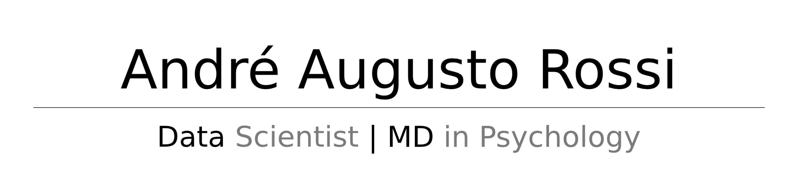

**I am a Data Scientist aspirant. My carrer includes many jobs as a volunteer, as an electronic technician and more than 7 years of clinical service as a psychologist / psychoanalyst. In my master degree I was introduced to statistics and machine learning, which in the future will motivate me to invest in data science. My main goal is to unite my human sensibility and my logical side to find solutions to different kinds of problems using data science.**  

  
    
    

---
## Tools

 <table>
  <tbody>
    <tr valign="top">
      <td width="20%" align="center">
        Linux  
        
      </td>
      <td width="20%" align="center">
        Python  
        
      </td>
      <td width="20%" align="center">
        PostGreSQL  
        
      </td>
      <td width="20%" align="center">
        Power BI  
        
      </td>
      <td width="20%" align="center">
        Flask  
        
      </td>
    </tr>
    <tr valign="top">
      <td width="20%" align="center">
        Heroku  
        
      </td>
      <td width="20%" align="center">
        Classification  
        
      </td>
      </td>
      <td width="20%" align="center">
        Regression  
        
      </td>
    <td width="20%" align="center">
        Clustering  
        
      </td>
      <td width="20%" align="center">
        Time Series  
        
  </tbody>
</table>

---
 ## Data Science Projects
  ### [Rossmann Sales Forecast](https://github.com/andreaugustorossi/Rossmann-Kaggle)

This project offers an end-to-end solution to a Kaggle challenge as if it were a real industry situation. A simple and optimized AI solution that gives sales forecasts for the next six weeks of the 1115 stores available can be accessed on a mobile phone via the Telegram app bot.

Repository: https://github.com/andreaugustorossi/Rossmann-Kaggle

### [Cardiovascular Disease Prediction](https://github.com/andreaugustorossi/Cardio-Disease-Kaggle)

This project was based on the Kaggle data set that provides information on 70,000 patients with and without cardiovascular disease. The machine learning solution was based on an industry-oriented approach, in which a hypothetical company obtains its profits based on the accuracy of diagnostics. The results of this project show that the company will never again have a debt, but a profit of $ 105,070,000.00, an increase in revenues of 68.8%.

Repository: https://github.com/andreaugustorossi/Cardio-Disease-Kaggle
